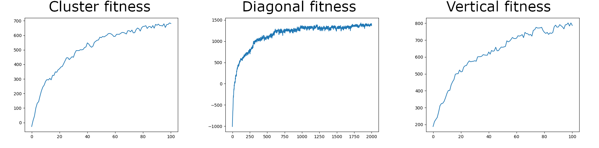

## AI picture generator
Created by:
  @ackar8985
  @debitcash
  
Generates Suprematist-style images by creating shapes with random sizes, locations, and colors, applying a genetic algorithm, and displaying the result after the n-th generation.

A successful Suprematist picture should follow these approaches:
- Cluster: Suprematist shapes concentrated within a cluster (circle), with their sides aligned parallel.
- Vertical: Shapes arranged within a vertical channel.
- Diagonal: Shapes placed along a diagonal channel.

All compositions must feature Suprematist colors, and the fitness calculation is based on following these criteria.

Cluster approach results:
---

Diagonal approach results:
---

Vertical approach results:
---

Last generation fitness results:
---

